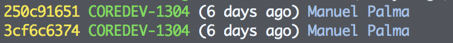
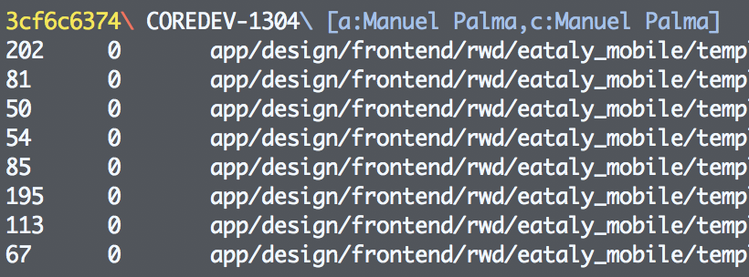

# Git-Pretty-Configuration
Configure Git for pretty terminal outputs

`git config --global alias.ls 'log --pretty=format:"%C(yellow)%h %C(green)%s %Creset(%ad) %C(blue)%an" --date=relative'`

`git config --global alias.ll 'log --pretty=format:"%C(yellow)%h%Cred%d\\ %Creset%s%Cblue\\ [a:%an,c:%cn]" --decorate --numstat'`

`
git config --global color.status.added "yellow"
git config --global color.status.changed "green"                                                                             
git config --global color.status.untracked "cyan"
`
